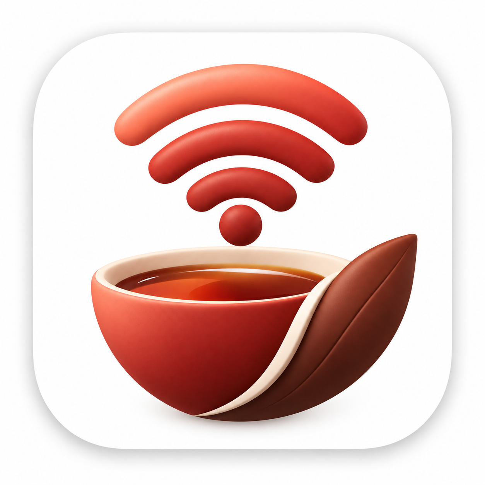

<p align="center">
  
</p>

<h1 align="center">blacktea</h1>

<p align="center">
  <a href="README.md">English</a> |
  <a href="README.zh-TW.md">繁體中文</a>
</p>

<p align="center">
  <strong>可被 AI 控制的 macOS HTTP 除錯代理。</strong>
</p>

<p align="center">
  攔截、檢視、改寫 HTTP/HTTPS/WebSocket/GraphQL 流量的原生 Swift app —<br>
  而且可以讓 MCP client 幫你建立 mock 規則，不必自己一個個對話框點過去。
</p>

<p align="center">
  
  
  <a href="LICENSE"></a>
</p>

---

> [!NOTE]
> blacktea 是某個 AGPL-3.0 上游專案的個人 fork。以下描述的功能大多是該專案的成果，
> 著作權標示請見 [COPYRIGHT.md](COPYRIGHT.md)。本版本刻意改名換 icon，因為上游授權
> 並未涵蓋其名稱、標誌與產品識別。這不是官方版本，也未經上游背書。
> 有問題請回報到這裡，不要回報到上游。

## 這個 fork 加了什麼

上游內建的本機 MCP server 提供十個**唯讀** tool。AI client 可以看流量、列規則，但不能動手 ——
建一條 Map Local 規則還是得右鍵、填對話框。

blacktea 補上三個可寫入的 MCP tool，讓 MCP client 能把 mock 從頭設到尾：

| Tool | 功能 |
|------|------|
| `create_map_local_rule` | 讓符合條件的請求回傳指定的本地檔案 |
| `set_rule_enabled` | 依 id 啟用／停用規則 |
| `delete_rule` | 依 id 刪除規則 |

跟你的 client 說「把 `/v4/merchant/serviceProvider` mock 成 `{"centerId":"..."}`」，
它就會寫好檔案、建好規則，並確認已經落地。

**設計取捨：**

- **預設關閉。** 寫入權限由 `MCPWriteAccessPolicy` 控管（`UserDefaults` 的
  `mcpWriteToolsEnabled`）。關閉時這些 tool 不會出現在 `tools/list`，也不能被呼叫。
  能建立 Map Local 規則的 client 等於能改寫所有經過 proxy 的回應，所以這個能力必須明確
  選擇開啟，而不是開了 MCP server 就自動附贈。
- **與 UI 走同一條路。** 所有變更都經過 `RulePolicyGate`，也就是規則編輯視窗用的同一個閘門，
  因此配額與持久化行為不論規則從哪個介面建立都完全一致。
- **落地才算成功。** tool 只有在變更確實寫入磁碟後才回報成功 —— 不會發生「顯示已儲存但重開就不見」。
- **先驗證再變更。** 對應的檔案必須存在、regex 必須編譯得過、`status_code` 必須落在
  `100...599`。被拒絕的呼叫不會在規則集留下任何痕跡。

開啟方式：

```bash
defaults write com.amunx.rockxy.community mcpWriteToolsEnabled -bool true
```

接著在 **Settings → MCP → Enable MCP Server** 打開伺服器，重啟 app。

## 功能

以下功能皆來自上游。

### 流量擷取

檢視任何 Mac app、CLI 或 iOS 裝置的 HTTP、HTTPS、WebSocket、GraphQL 流量。
瀏覽器 DevTools 只看得到瀏覽器，這個看得到你技術棧的其他部分。

`HTTP / HTTPS` · `WebSocket` · `GraphQL` · `iOS 裝置與模擬器` · `依 Process ID 過濾` · `時序瀑布圖`

### 規則

Map Local、Map Remote、封鎖／允許清單、修改 Header、中斷點、網路條件模擬 ——
完整的改寫工具組。規則不夠用時還有 JavaScriptCore 腳本引擎。

`Map Local` · `Map Remote` · `中斷點` · `修改 Header` · `網路條件` · `JS 腳本`

### 進階過濾與搜尋

幾秒內從上千筆請求中找到目標。可組合 method、host、狀態碼、header、body、process
等條件，或直接對整個 session 全文搜尋。

`多欄位過濾` · `全文搜尋` · `Header / Body 比對` · `儲存過濾條件`

### 開發者設定中心

提供 Python、Node.js、Go、Rust、cURL、Docker 與各家瀏覽器的 proxy 設定片段，
按 Run Test 即可確認流量真的有通。

### AI 助理

選取擷取到的請求，直接問發生了什麼、哪裡失敗、下一步該驗證什麼。
分析優先在本機執行；設定好的 Ollama 或雲端模型只有在 Review Data 顯示過
實際送出的、經過裁切與遮蔽的內容之後才會啟動。

## 快速開始

```bash
git clone https://github.com/popochess/blacktea.git
cd blacktea
cp Configuration/Developer.xcconfig.template Configuration/Developer.xcconfig
# 把 ROCKXY_TEAM_ID 改成你的 Apple Developer Team ID
open Rockxy.xcodeproj
```

在 Xcode 建置執行。Welcome 視窗會帶你完成 root CA 安裝、helper 安裝與 proxy 啟用。

**需求：** macOS 14.0+、Xcode 16+、Swift 5.9

> Bundle identifier、Xcode 專案檔名與 `ROCKXY_*` 建置設定仍沿用上游名稱。
> 這些是實際生效的識別字 —— 改掉會讓已安裝的 root CA、特權 helper 註冊
> 與所有既存偏好設定全部失效。上面的指令都是可直接複製執行的。

### iOS 模擬器

模擬器共用 Mac 的網路堆疊，所以會自動沿用 macOS 系統 proxy。
但它有自己獨立的信任庫，因此每台模擬器都要各自安裝 root CA：

```bash
xcrun simctl keychain <udid> add-root-cert \
  ~/Library/Application\ Support/com.amunx.rockxy/Certificates/rootCA.pem
```

裝好後請**冷啟動**目標 app —— 熱啟動可能沿用先前失敗的 TLS session 快取。

## 文件

上游文件放在 [`docs/`](docs/)，除上述差異外同樣適用於這個 fork。
建置請看 [`docs/development/building.mdx`](docs/development/building.mdx)，
MCP 設定請看 [`docs/features/mcp.mdx`](docs/features/mcp.mdx)。

## 授權

AGPL-3.0-or-later，已標示的第三方素材除外。詳見
[LICENSE](LICENSE)、[LICENSING.md](LICENSING.md)、[COPYRIGHT.md](COPYRIGHT.md)。

Copyright 2024–2026 Nguyen Huu Loc (Stephen) 與 Rockxy Contributors，
以及本 fork 的貢獻者。若你將本軟體的修改版本作為網路服務運行，
AGPL 要求你必須向使用者提供其原始碼。

---

<p align="center">
  <sub>以 Swift、SwiftNIO、SwiftUI、AppKit 打造。</sub>
</p>
